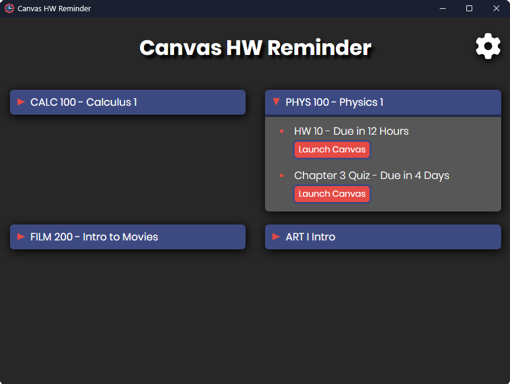
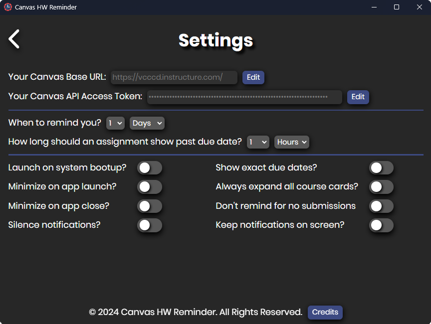
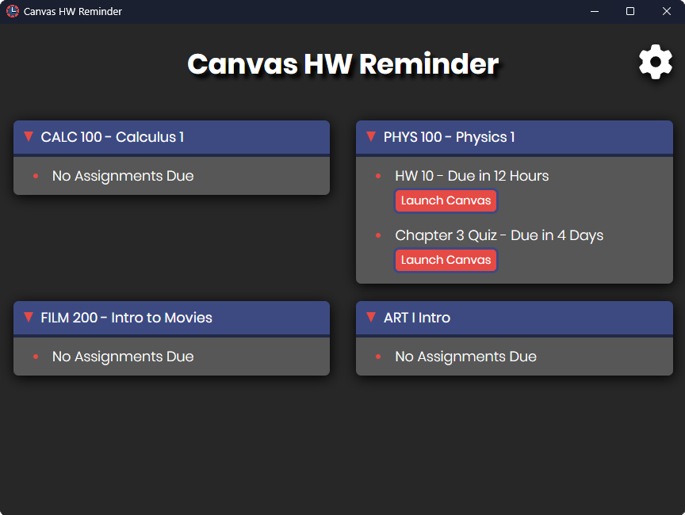
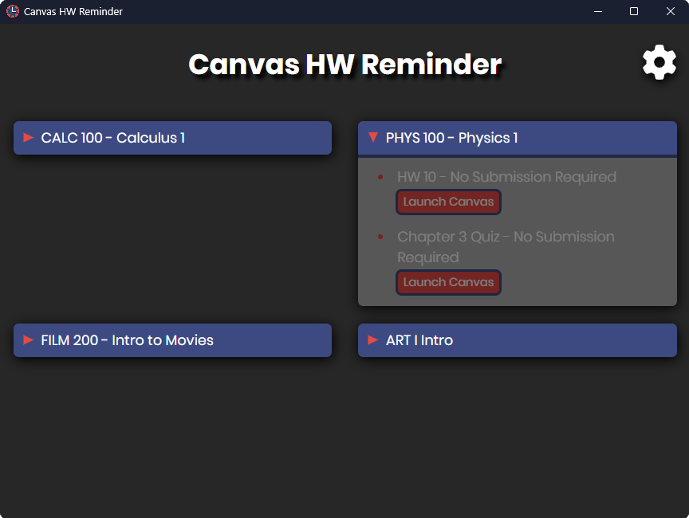
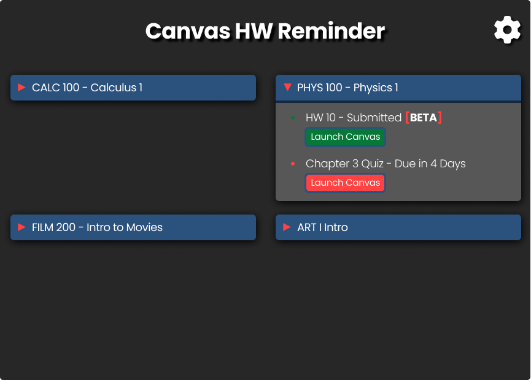
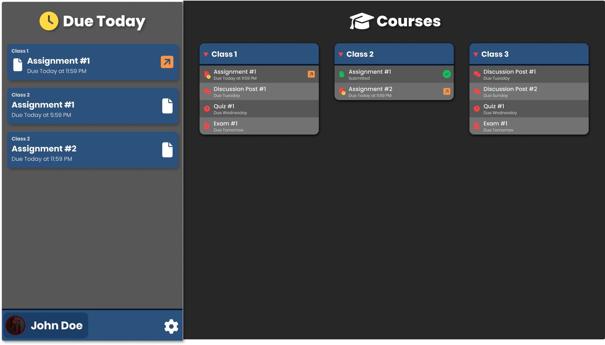

# Canvas HW Reminder
---
**Designed for College Students by College Students**

Canvas HW Reminder is a student designed desktop app that reminds college students about their upcoming assignments on Canvas through desktop notifications.

## How it Works?
- Every hour, Canvas HW Reminder searches through the student's Canvas page for any new upcoming assignments. 
- Once assignments are found, it will be saved and organized in order of the closest due date.
- Then Canvas HW Reminder will setup a notification to notify the student at the time of their choosing.
- **All Information is Always Saved Locally and Never Sent to Any Server!**

## What Powers It?
- **ElectronJS** - Handles rendering and app functionality.
- **Canvas LMS Instructure API** - Allows connectivity to Canvas to retrieve assignment information for student.
- **Keytar** - Allows Student Credentials to be Securely Stored onto Local System.

## Upcoming Features
- [ ] UI Redesign
- [ ] Add Support Multiple Reminders Per Assignment

## Customize to Your Liking

### Launch on System Bootup
Allow Canvas HW Reminder to Launch on User's Machine Bootup

### Minimize on App Launch
Automatically minimize Canvas HW Reminder to System Tray when it is launched by user.

### Minimize on App Close
Minimize Canvas HW Reminder to System Tray when it is closed by user.
### Silence Notifications
Silence all reminder notifications.

### Show Exact Due Date
Show the precise month, date, and time the assignment is due. ("Due on 10/2 at 11:59 PM")

### Always Expand All Course Cards
All course cards will automatically expand regardless of whether any assignments within it are due or not.

### Don't Remind for Assignments with No Submissions
Don't remind assignments that don't require any submission.

### Keep Notifications On-Screen
Prevent notifications from automatically being dismissed and going to notification center.

## Auto Mark Submitted Assignments? **[BETA]**

Canvas HW Reminder has a new **BETA** feature that will intelligentily identify what assignments that are due have been submitted or not.

## UI Redesign

This is the new UI redesign of Canvas HW Reminder to be more intutive and easier to use.